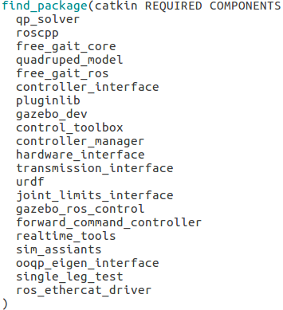

##1.add_subdirectory为构建添加一个子路径

`add_subdirectory(source_dir [binary_dir] [EXCLUDE_FORM_ALL])`

`source_dir`指定了Cmakelist.txt源文件和代码文件的位置。如果source_dir是一个相对路径，那么source_dir选项会被解释为相对于当前的路径，但是它也可以是一个绝对路径。

`binary_dir`指定了输出文件的路径，但也可以是一个绝对路径，同上。

**作用：为构建添加一个子路径，主目录的代码调用子目录的代码**

##2. add_library 静态库与动态库构建

``add_library(<name> [STATIC | SHARED | MODULE])
[EXCLUDE_FORM_ALL]
source1 source2 ...sourceN``

**作用：生成一个名为<name>的库文件，该库文件将会根据调用的命令里列出的**源文件**来创建**

##3.外部共享库和头文件的使用

`include_directories([AFTER|BEFORE] [SYSTEM] dir1 dir2 ...)`

**作用：将给定的路径添加到编译器，使编译器搜索头文件**

`target_link_libraries()`

**作用：将给定的一个库链接到一个目标上**

`cmake_tutorial：`

**主目录**：`tutorial.cpp` `Cmakelist.txt`

**子目录**：`MathFunctions`

**子目录中的CMakeList.txt文件：**

`add_library(MathFunctions mysqrt.cpp)`将源文件生成一个共享库

**主目录中的CMakeList.txt文件：**

`add_subdirectory(MathFunctions)`添加子目录，否则在QT文件列表中不会显示该子目录

`include_directories("${PROJECT_SOURCE_DIR}/MathFunctions")`添加`mysqrt.h`头文件路径

`target_link_libraries(${PROJECT_NAME}_node MathFunctions)`将`mysqrt`共享库链接到`tutorial`主函数
## 4.find_package()

**作用：查找 编译依赖的CMake包**

编译一个项目，需要使用CMake的``find_package``函数确定依赖的其他CMake包并找到它们，一般情况下至少会有一个catkin依赖：

``find_package(catkin_REQUIRED)``

``find_package``具体功能：

如果CMake通过``find_package()``查找到一个软件包，它就会创建若干个CMake环境变量，以提供有关已查找到的软件包的信息。这些环境变量可以在后面的CMake脚本中使用：

``<NAME>_Found:``当库被查找到时置为True，否则为False；

``<NAME>_INCLUDE_DIRS``或``<NAME>_INCLUDE:``软件包导出的头文件路径；

``<NAME>_LIBRARIES``或``<NAME>_LIBS``:软件包导出的库的路径；

### 4.1 find_package(catkin REQUIRED COMPONENT nodelet)

**项目依赖的软件包，都会自动成为``catkin``的组件**

以``catkin_prefix``的形式创建一组环境变量，这意味着nodelet导出的头文件路径、库等都会附加到``catkin_variables``上，例如``catkin_INCLUDE_DIRS``不仅包含catkin的头文件路径，也包含了nodelet的头文件路径.``catkin_LIBRARIES``

**WHSY EXAMPPLE:**



**所有的依赖包都会成为catkin的组件，环境变量保存在``catkin_variables``中,在后面的脚本中可以直接调动 ``catkin_INCLUDE_DIRS``和``catkin_LIBRARIES``.**

## 5.catkin_package()

``catkin_package()``是一个由catkin提供的CMake宏,需要指定特定的catkin信息到编译系统，而这些信息又会被用于生成pkg-config和CMake文件。

``catkin_package parameters:``

``INCLUDE_DIRS:``软件包导出的头文件路径；

``LIBRARIES：``项目导出的库；

``CATKIN_DEPENDS:``当前项目依赖的其他catkin项目；

``DEPENDS：``当前项目依赖的非catkin CMake项目；

**EXAMPPLE:**
````
catkin_package( INCLUDE_DIRS include  
                LIBRARIES ${PROJECT_NAME}   
                CATKIN_DEPENDS roscpp nodelet   
                DEPENDS eigen opencv)
````
**LINK:** https://zhuanlan.zhihu.com/p/62344573

## 6.使用链接第三方库

``include_directories()``

``link_directories()``

``target_link_libraries()``

**LINK:** https://blog.csdn.net/ly890700/article/details/72808426
 ## 
